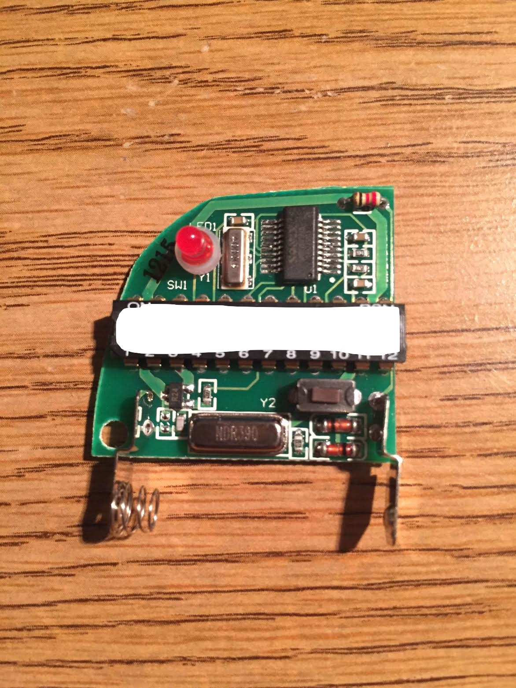
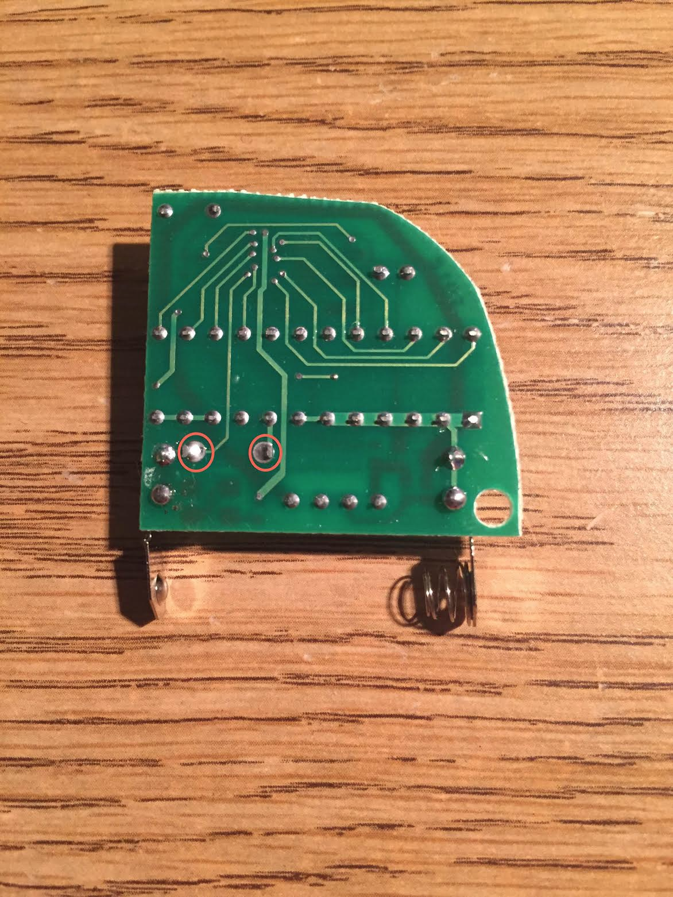
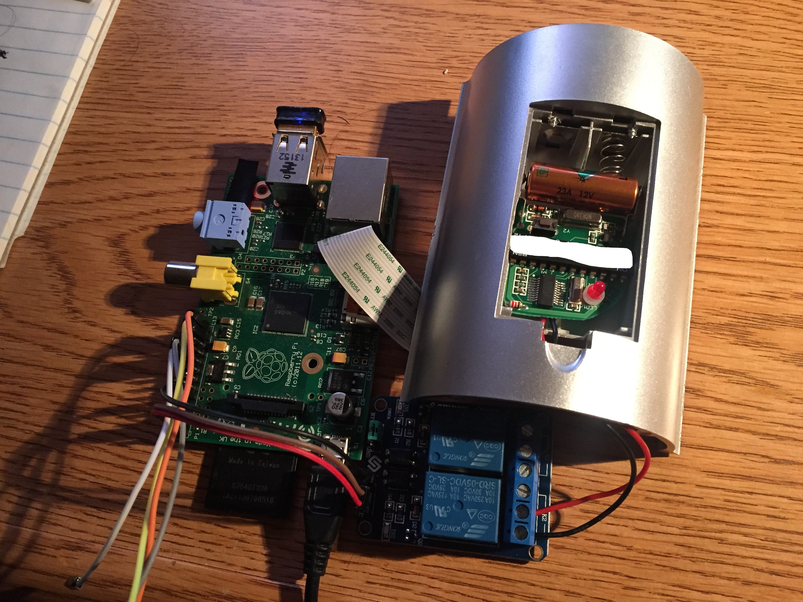
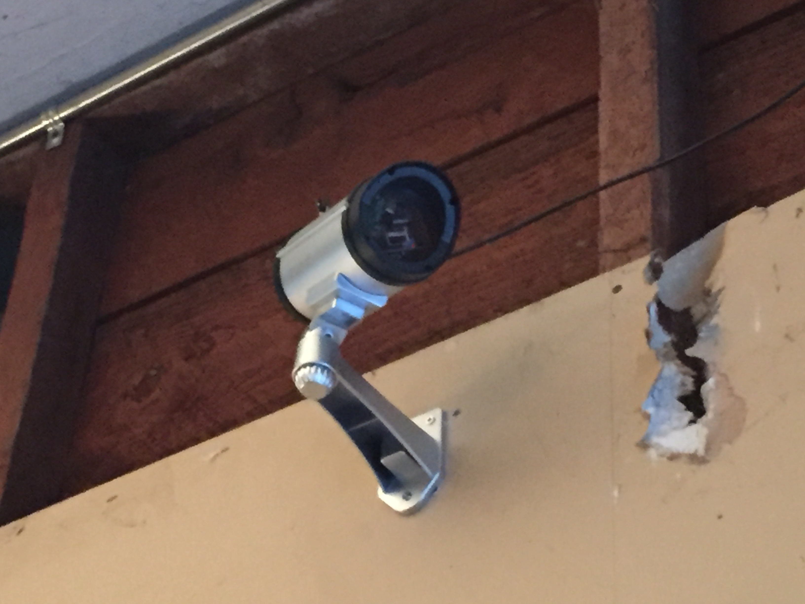

Garage Door Control
=========================== 

Garage Door Control is a collection of services providing monitoring and control of Genie GPT-1 compatible garage door systems operating on the 390MHz band.

### Features
- Smartphone web app providing remote toggling of a wireless transmitter.
- Magnetic switch sensing capability providing visual representation of open/closed states.
- Live picture preview.
- Live video preview with motion detection and video storage.

## Software Setup

#### Requirements
- Docker compatible Raspbian install.
- Camera module must be enabled.
- [Docker-Compose (with virtualenv)](https://docs.docker.com/compose/install/#/alternative-install-options)

Assuming Docker-Compose is installed via virtualenv in the directory “docker-compose”:

	source docker-compose/bin/active

Clone the repository:

	git clone https://github.com/abarruda/garage-door-control

Build the services:

	cd garage-door-control
	docker-compose build

Start the service:

	docker-compose start

#####This will install:
- [RPi-Cam-Web-Interface](http://elinux.org/RPi-Cam-Web-Interface) for live picture and video preview and motion detection.

		Access the interface on port 8080 (http://<raspberrypi-IP>:8080)

- garage-door-control API that controls the relay and reads the magnetic sensor values.
- garage-door-control User Interface

		Access the interface on port 80 (http://<raspberrypi-IP>)

## Construction

#### Components
- Raspberry Pi Model B with wireless networking
> `Newer versions likely compatible with some modifications necessary due to architecture change and fit within mock casing.`
- Raspberry Pi Camera Board Module
- [GPT-1 390 MHz compatible remote](https://www.amazon.com/gp/product/B00286K95U)
- [5V relay](https://www.amazon.com/gp/product/B00E0NTPP4)
- (2) [Magnetic sensor](Magnetic sensor) and [actuator flange](http://www.digikey.com/product-detail/en/littelfuse-inc/57145-000/57145-000-ND/43980)
- [Mock security camera casing](https://www.amazon.com/gp/product/B004D8NZ52)

#### Build
- Remove the remote casing from the board.  You should be left with something similar to the following:

- Construct the circuit that connects the remote control to the relay that connects to the raspberry pi.  Steps 6 and 7 in this [guide](https://coderwall.com/p/jsd5mw/raspberry-pi-garage-door-opener-with-garagepi) were used as a template for the wiring design.  The contacts circled were soldered to wires that connected to the relay:

- The relay and magnetic sensors connects to the following GPIO pins:
Pin 3: relay
Pin 23: magnetic sensor representing “closed” position
Pin18: magnetic sensor representing “open” position
> Any of these pin values can be changed in the “properties.ini" file in the “api" directory.

- The camera module is connected to the mock security camera casing where the mock camera is placed.  The genie remote is placed in the battery compartment of the mock casing.  A bit of the genie remote board had to be shaved off in addition to shaving some of the mock casing’s battery compartment to allow the genie remote board to fit into the battery compartment.  When finished the upper casing should look similar to the following:

- The raspberry pi, relay and casing is put together with a hole cut in the rear part of the mock casing to allow the AC power cable to access the power port of the raspberry pi, as well as the raspberry pi’s GPIO pins.  The device is then mounted in a position facing the garage door:

`(apologies for the messy dry wall, I rent!)`